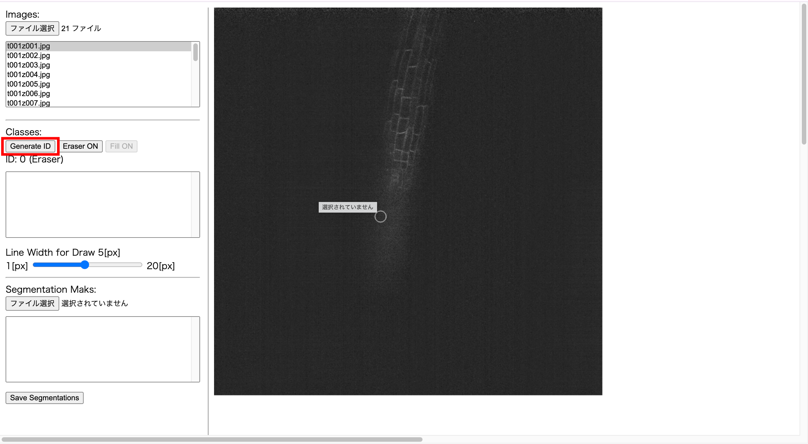

# 3DS-ISAT ( 3D-Stacked-Instance-Segmentation-Annotation-Tool )

## What is "3D-Stacked Instance Segmeantation" ?
Input is stacked 2D-images that slices 3D-space at each z-plane. Then the output from 3D-Stacked Instance Segmentation (3DS-IS) are obtained as 3D-stacked masks that clarify the regions of each instances. Especially, outputted labels on each masks are consistent over all sliced images.

  

## How to use

### 1. Open the HTML

Access to html page by double clicking the `isat.html`.

    

### 2. Image upload

Upload multiple images ordered by `z` (ascending or decending is OK) by multi-select (on mac, `cmd` + click or `shift` + click). This application supports `.jpg`, `.jpeg` and `.png`.

    

Then dialog will be open and you can select images.

    

And you can switch the image by selecting an image in the list.

    

### 3. Generate and select ID 

Before you annotate regions, you need to push `Generate ID` to begin annotation. Of course each ID corresponds each instances. 

    

The case below indicates the bottom have pushed three times.

    

where `ID:3` is selected. And colors and three values like `(*, *, *, *)` indicate the color `(R, G, B, A)` used when drawing. 

# Draw segmentation mask

When you hold clicking, the line whose color is what selected on step 3 is drawn. 

    

If you want to erase drawn lines, push the botton `Eraser ON` and hold clicking where you want to do so. 

    
    

### 4. Save segmentation-mask

When you want to save annotations (even when you want to pause and save interim results), push the `save segmentations`. Then you will obtained array-like text files named the same to original images. The values on saved text files indicates labels (0 means background and others are instances). 

    

### Mores 

1. Change the scale: When scorolling the mouse, you can close up or pull back.

2. Change the size of draw: The scroll bar in left side changes the size.

3. Restart the annotation: `Choose file` on `Segmentation Mask` can load what you had annotated.

